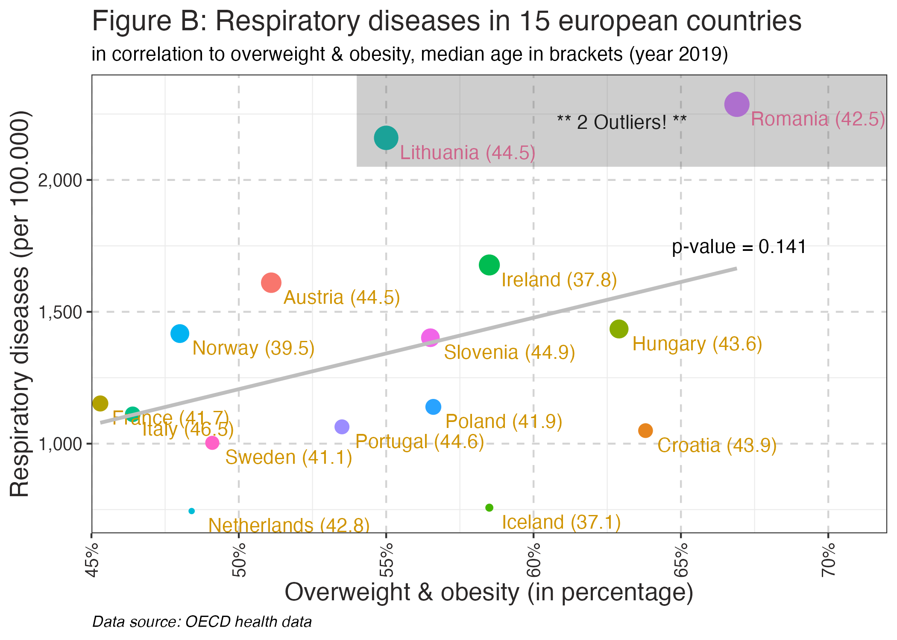

```{r setup, include = FALSE}
## Setup the report
knitr::opts_knit$set(progress = FALSE, verbose = FALSE)
debug_var = TRUE # Set to `FALSE` to NOT show code chunks (for word counting)
knitr::opts_chunk$set(
  echo = debug_var,
  warning = FALSE,
  error = FALSE,
  message = FALSE)
```

```{r libraries, message = FALSE}
## Libraries
# Loading packages
pacman::p_load(tidyverse, openai, gridExtra, gt, webshot2, janitor, here)

## Set variables
OPENAI_API_KEY = Sys.getenv("OPENAI_API_KEY") # Setting API key for OpenAI
YEAR = 2019 # Setting year for analysis
CITY = "Milano" # Setting city for analysis

# List files in working directory
list.files("./")
```

# Introduction, context, and audience

**Note:** *The report builds on the presentation for the management, but looks 
at more factors influencing possible respiratory diseases and adds a country-specific 
view.*

This is data-driven report about respiratory diseases from a physiotherapeutic 
perspective. It is stored in a public [**Github Repository**](https://github.com/DrBenjamin/Assessment). 

The purpose of this report is to show the present audience, Physiotherapists of
the **Good Hope Clinic** in `r CITY`, the **importance of physiotherapeutic 
measures** in cases of respiratory diseases as this health restriction is 
widespread long before COVID-19. For instance, China is facing a 
rise in respiratory diseases after lifting zero-COVID restrictions [@Hawkings].

Another major public health problem is obesity. In view of increasing life expectancy,
the prevalence of obesity is rising steadily in older age groups
[@Jura-Kozak]. @WHO defines overweight as a body mass index (BMI) of
**25** to **29.9 kg/m2** and obesity as a BMI of **30 kg/m2** or higher.
Obesity is a risk factor for many diseases, such as cardiovascular
diseases, diabetes mellitus, cancer and musculoskeletal diseases. 

Some researchers see a relation between high amount of **abdominal fat** and the 
function of the **respiratory system** [@Rauch]. From policy maker side, there are
initiatives to reduce the occurrence of obesity, for instance Columbia
introduced a tax for fast food [@Daniels].

The aim of this study is to determine the degree of relevance of the topic "Obesity"
for professionals working in the field of physiotherapy with clients that have a
resp. disease.

**Is obesity a risk factor for respiratory diseases?**

# Data wrangling and coding

The data was found on the *Organisation for Economic Cooperation and Development
(OECD)* data repository as on different websites - for instance from *Statista*, 
a global data and business intelligence platform.

The data from OECD shows the total number of **respiratory diseases** per country 
and year. 

```{r code_wrangling1, echo = TRUE, include = debug_var}
## Processing OECD Health data of respiratory diseases
{
  # Source: https://stats.oecd.org/viewhtml.aspx?datasetcode=HEALTH_PROC&lang=en#
  oecd_data_raw <- read_csv(here("raw_data/", "HEALTH_PROC_10112023095631477.csv"))
  
  # Eyeballing data
  oecd_data_raw %>% glimpse() # Country names are in English language, `Türkiye` is used instead of `Turkey` see
  # https://www.theguardian.com/world/2022/jun/03/turkey-changes-name-to-turkiye-as-other-name-is-for-the-birds
  oecd_data_raw %>% skimr::skim()
  oecd_data_raw %>% tabyl(Country, Year, show_na = FALSE) %>% # Shows 2018 the highest number of observations
    adorn_totals("row") %>%
    adorn_percentages("row") %>%
    adorn_pct_formatting(digits = 1) %>%
    adorn_ns %>%
    adorn_title %>%
    head(5)
  
  # Preparing the OECD data
  oecd_data_tidy <- oecd_data_raw %>%
    filter(Variable == "Diseases of the respiratory system") %>%
    # Get the absolute number of resp. diseases
    filter(Measure == "Number") %>%
    select(Year, Country, Variable, Value) %>%
    arrange(Year) %>%
    pivot_wider(names_from = Variable, values_from = Value) %>% 
    filter(Year == YEAR) %>%
    select(Country, starts_with("Diseases")) %>%
    mutate(Country = Country %>%
      factor())
}
```

On a Github repository data about **air pollution** is available. This data is 
captured for countries and cities of Europe. Several air pollution indicators are 
present. In this report the *PM2.5* (particulate matter with a diameter size of 
2.5 micrometers or smaller) is used.

As the air pollution data is also available per city, it will be filtered by
the `CITY` variable, which is set to `r CITY`, as this report is adopted to
Physiotherapists in a clinic in Milan.

```{r code_wrangling2, echo = TRUE, include = debug_var}
## Processing air pollution data
{
  # Source: https://github.com/dw-data/edjnet-pm2p5)
  # Reading data 
  air_pollution_data_raw <- read_csv(here("raw_data/", "CAMS-Europe-Renalaysis-Countries-Yearly-2018-2022.csv"))
  air_pollution_cities_data_raw <- read_csv(here("raw_data/", "CAMS-Europe-Renalysis-Yearly-2018-2022.csv"))
  
  # Eyeballing data
  air_pollution_data_raw %>% glimpse() # Country names are each in their local language
  air_pollution_data_raw %>% skimr::skim()
  air_pollution_data_raw %>% tabyl(`Name (latin characters)`, Year, show_na = FALSE) %>% # Shows for all years (2018 - 2022) the same amount of observations
    adorn_totals("row") %>%
    adorn_percentages("row") %>%
    adorn_pct_formatting(digits = 1) %>%
    adorn_ns %>%
    adorn_title %>%
    head(5)
  air_pollution_cities_data_raw %>% glimpse() # Country names are each in their short code
  air_pollution_cities_data_raw %>% skimr::skim()
  air_pollution_cities_data_raw %>% tabyl(`Name (latin characters)`, Day, show_na = FALSE) %>% # Shows for all years (2018 - 2022) the same amount of observations
    adorn_totals("row") %>%
    adorn_percentages("row") %>%
    adorn_pct_formatting(digits = 1) %>%
    adorn_ns %>%
    adorn_title %>%
    head(5)
  
  # Preparing the air pollution data
  air_pollution_data_tidy <- air_pollution_data_raw %>%
    select(Year, "Name (latin characters)", "Yearly PM 2.5 average (µg/m³)", "Population estimate (GHSL 2020)") %>%
    rename(Country = "Name (latin characters)", PM2.5 = "Yearly PM 2.5 average (µg/m³)", Pop = "Population estimate (GHSL 2020)") %>%
    filter(Year == YEAR) %>%
    select(Country, PM2.5, Pop) %>%
    mutate(Country = Country %>%
      factor())
  
  # Preparing the air pollution data for cities
  air_pollution_cities_data_tidy <- air_pollution_cities_data_raw %>%
  select(Day, `Country code`, "Name (latin characters)", "Daily PM 2.5 average (µg/m³)") %>%
    rename(Code = `Country code`, City = "Name (latin characters)", PM2.5 = "Daily PM 2.5 average (µg/m³)") %>%
    filter(Day == paste0(YEAR, "-12-31")) %>%
    select(City, Code, PM2.5) %>%
    mutate(City = City %>%
             factor(),
           Code = Code %>%
             factor())
  # Storing PM2.5 value for the selected city
  city_pm <- air_pollution_cities_data_tidy %>%
    filter(City == CITY) %>%
    select(PM2.5) %>%
    as.numeric()
}
```

From a clinical perspective, **overweight and obesity** data is of interest as 
it is a risk factor for many health-related problems. The data taken is available
on the OECD website.

```{r code_wrangling3, echo = TRUE, include = debug_var}
## Processing overweight / obesity data
{
  # Source: https://data.oecd.org/healthrisk/overweight-or-obese-population.htm
  # Reading data
  obesity_data_raw <- read_csv(here("raw_data/", "DP_LIVE_02112023125750641.csv"))
  
  # Eyeballing data
  obesity_data_raw %>% glimpse() # Country names are in a 3-letter country-code format
  obesity_data_raw %>% skimr::skim()
  obesity_data_raw %>% tabyl(LOCATION, TIME, show_na = FALSE) %>% # Shows 2019 the highest number of observations
    adorn_totals("row") %>%
    adorn_percentages("row") %>%
    adorn_pct_formatting(digits = 1) %>%
    adorn_ns %>%
    adorn_title %>%
    head(5)
  
  # Preparing the obesity data
  obesity_data_tidy <- obesity_data_raw %>%
    filter(TIME == YEAR) %>%
    select(LOCATION, Value) %>%
    rename(Country = LOCATION) %>%
    group_by(Country) %>%
    # Explain why I used the mean and not dropped the `self_measured` column
    summarise(Value = mean(Value, na.rm = TRUE)) %>%
    mutate(Country = Country %>%
           factor())
}
```

Smoking is a major risk factor for many diseases, as an extensive body of academic
literature and research is showing. Smoking is predominantly associated with the 
etiology of lung cancer and a range of pulmonary diseases. Therefore, data on the 
percentage of smokers in the population are also included in the analysis.

```{r code_wrangling4, echo = TRUE, include = debug_var}
## Processing smoke data
{
  # Source: https://www.statista.com/statistics/433390/individuals-who-currently-smoke-cigarettes-in-european-countries/
  # Reading data 
  smoking_data_raw <- read_csv(here("raw_data/", "statistic_id433390_current-smokers-in-europe-2020-by-country.csv"))
  
  # Eyeballing data
  smoking_data_raw %>% glimpse()
  
  # Preparing the obesity data
  smoking_data_tidy <- smoking_data_raw %>%
    mutate(Country = Country %>%
             factor())
}
```

On the **CIA Factbook**, the index of the *median age*, that summarizes the
age distribution of a population, is distributed. Currently, the median age
per country ranges from a low of about 15 in Niger or Uganda to 45 or more in 
several European countries or Japan. The `Median age` variable can be seen as a 
potential confounder on the correlation between `respiratory diseases` (dependent) 
and other variables like `air pollution` (independent).

```{r code_wrangling5, echo = TRUE, include = debug_var}
## Processing median age data
{
  # Source: https://www.cia.gov/the-world-factbook/field/median-age/country-comparison/
  # Reading data
  age_data_raw <- read_csv(here("raw_data/", "cia_factbook_median_age.csv"))
  
  # Eyeballing data
  age_data_raw %>% glimpse()
  
  # Preparing the obesity data
  age_data_tidy <- age_data_raw %>%
    select(name, value) %>%
    rename(Country = name, `Median age` = value) %>%
    mutate(Country = Country %>%
             factor())
  
  # Remove unused data / values from Global Environment
  rm(list = c("air_pollution_data_raw", "obesity_data_raw", "oecd_data_raw", "air_pollution_cities_data_raw", "air_pollution_cities_data_tidy", "smoking_data_raw", "age_data_raw"))
}
```

**Note:** *The different datasets used incompatible encodings for the country 
variable, English language, local language or a code, which lead to the need to
normalize them to a standardized convention. In this case the English naming for
country and continent is chosen.*

As Large Language Models (LLM) are an effective way to automate the processing of
large amounts of text, the OpenAI API is used to convert the country variables in
a consistent matching format. Secondly, the API is used to associate each state 
with its corresponding continental landmass, as this data is missing and needed 
for grouping by continents.

```{r code_wrangling6, echo = TRUE, include = debug_var}
## Checking common countries in the datasets
## ChatGPT or loading existing data
if (nchar(OPENAI_API_KEY) == 51) {
  message("API key is valid, requesting data from OpenAI")

  ## Filter unique countries and continents
  # Filter dataset `oecd_data_tidy`
  countries_oecd <- oecd_data_tidy %>%
    select(Country) %>%
    distinct() %>%
    arrange(Country)
  
  # Filter dataset `air_pollution_data_tidy`
  countries_airpol <- air_pollution_data_tidy %>%
    select(Country) %>%
    distinct() %>%
    arrange(Country)
  
  # Filter dataset `obesity_data_tidy`
  countries_obesity <- obesity_data_tidy %>%
    select(Country) %>%
    distinct() %>%
    arrange(Country)
  
  # Filter dataset `smoking_data_tidy`
  countries_smoking <- smoking_data_tidy %>%
    select(Country) %>%
    distinct() %>%
    arrange(Country)
  
  # Filter dataset `age_data_tidy`
  countries_age <- age_data_tidy %>%
    select(Country) %>%
    distinct() %>%
    arrange(Country)
  
  ## Convert country tibbles to chr
  # Create empty vector
  countries <- character()
  # OECD data,
  countries <- append(countries, list(levels(countries_oecd$Country)))
  # air pollution data
  countries <- append(countries, list(levels(countries_airpol$Country)))
  # smoking data,
  countries <- append(countries, list(levels(countries_smoking$Country)))
  # age data,
  countries <- append(countries, list(levels(countries_age$Country)))
  # OECD obesity data
  countries <- append(countries, list(levels(countries_obesity$Country)))
  
  ## Request AI completion to standardize the country names
  # Loop through OpenAI ChatGPT completion
  countries_cleaned <- vector()
  check <- character()
  country <- character()
  continent_list <- ""
  for (i in 1:5) {
    # Remove unneeded character from country lists
    countries[i] <- countries[i] %>% gsub("\n", "", .) %>% gsub('\\"', "", .) %>% gsub("c(", "", ., fixed = TRUE) %>% gsub(")", "", ., fixed = TRUE)
    
    # Request AI completion, as long as output has same length as input
    while (length(strsplit(as.character(countries[i]), ", ")[[1]]) != length(strsplit(as.character(countries_cleaned[i]), ", ")[[1]])) {
      print("Input")
      print(paste(countries[i], collapse = ", "))
      print(paste0("Countries: ", length(strsplit(as.character(countries[i]), ", ")[[1]])))
      request <- create_chat_completion(model = "gpt-3.5-turbo", openai_api_key = OPENAI_API_KEY, messages = list(
        list("role" = "system", "content" = "You are a translator of country names or descriptions which comes often in national language, several anmes or abbrevations, into a single standard english country name. Use `Türkiye` instead of `Turkey`."),
        list("role" = "user", "content" = "I will give you a list of countries and I need you to reply just the english country names, comma seperated, without any further content! Please give me an sample output of '
                                           Türkiye, Danmark, DEU, Schweiz/Suisse/Svizzera, Shqipëria'."),
        list("role" = "assistant", "content" = "Türkiye, Denmark, Germany, Switzerland, Albania"),
        list("role" = "user", "content" = "Exactly, like that! Now I give you the list. `Türkiye` is the new name for formerly `Turkey`"),
        list("role" = "user", "content" = paste(countries[i], collapse = ", "))))
      countries_cleaned[i] <- request$choices$message.content
      print("Output")
      print(countries_cleaned[i])
      print(paste0("Countries: ", length(strsplit(as.character(countries_cleaned[i]), ", ")[[1]])))
      print("------------------")
    }
    
    # From chr to vector
    check <- append(check, list(strsplit(as.character(countries[i]), split = ", ")[[1]]))
    country <- append(country, list(strsplit(countries_cleaned[i], split = ", ")[[1]]))
    
    # Continent list
    if (i == 5) {
      # Loop as long number of countries are not equal to number continents
      while (length(unlist(country[i])) != length(continent_list)) {
        print("Input")
        print(paste(countries_cleaned[i], collapse = ", "))
        print(paste0("Country list length: ", length(unlist(country[i]))))
        request <- create_chat_completion(model = "gpt-3.5-turbo", openai_api_key = OPENAI_API_KEY, messages = list(
          list("role" = "system", "content" = "You convert country names to the english continent names they are on."),
          list("role" = "user", "content" = "I will give you a list of countries and I need you to print out the english continent names, comma seperate all countries, without any further content! Please give me an sample output of 'Germany, Mexico, Japan, Chile'."),
          list("role" = "assistant", "content" = "Europe, North Amercia, Asia, South America"),
          list("role" = "user", "content" = "Exactly, like that! Now I give you the list."),
          list("role" = "user", "content" = paste(countries_cleaned[i], collapse = ", "))))
        continent_list <- request$choices$message.content
        continent_list <- strsplit(continent_list, split = ", ")[[1]]
        print("Output")
        print(paste(continent_list, collapse = ", "))
        print(paste0("Continent list length: ", length(continent_list)))
      }
      
      # Find common countries in the lists
      country_list <- intersect(intersect(intersect(intersect(unlist(country[1]), unlist(country[2])), unlist(country[3])), unlist(country[4])), unlist(country[5]))
      
      # Save lists
      saveRDS(country_list, here("processed_data/", "country_list.rds"))
      saveRDS(continent_list, here("processed_data/", "continent_list.rds"))
      saveRDS(check, here("processed_data/", "check.rds"))
      saveRDS(country, here("processed_data/", "country.rds"))
    }
  }
} else {
  message("API key is invalid, loading data from disk ...")

  # Load lists, if API key is missing
  country_list <- readRDS(here("processed_data/", "country_list.rds"))
  continent_list <- readRDS(here("processed_data/", "continent_list.rds"))
  check <- readRDS(here("processed_data/", "check.rds"))
  country <- readRDS(here("processed_data/", "country.rds"))
}

## Show common countries
{
  print("############################")
  print(paste0("### Common countries: ", length(country_list), " ###"))
  print("############################")

  # Remove unused data / values from Global Environment
  rm(list = c("i", "request", "countries" ,"countries_cleaned", "countries_airpol", "countries_obesity", "countries_oecd", "countries_smoking", "countries_age"))
}
```

**Note:** *If no OpenAI API Key is provided, the code falls back to already stored
data in the repository.*

To prepare the datasets for plotting, it is needed to drop all observations in 
the datasets which are not in the common country list. This is done in the 
following code chunk.

```{r code_wrangling7, echo = TRUE, include = debug_var}
## Cleaning country descriptions
{
  ## Create dataset `oecd_data_plot`
  # Standardize country names ...
  oecd_plot <- oecd_data_tidy
  for (i in 1:length(unlist(country[1]))) {
    oecd_plot <- oecd_plot %>%
      mutate(Country = if_else(Country == unlist(check[1])[i], unlist(country[1])[i], Country))
  }
  # ... and filter for common countries in datasets
  oecd_plot <- oecd_plot %>%
    filter(Country %in% country_list)
  
  ## Create dataset `air_pollution_plot`
  # Standardize country names ...
  air_pollution_plot <- air_pollution_data_tidy
  for (i in 1:length(unlist(country[2]))) {
    air_pollution_plot <- air_pollution_plot %>%
      mutate(Country = if_else(Country == unlist(check[2])[i], unlist(country[2])[i], Country))
  }
  # ... and filter for common countries in datasets
  air_pollution_plot <- air_pollution_plot %>%
    filter(Country %in% country_list)
  
  ## Create dataset `smoking_data_plot`
  # Standardize country names ...
  smoking_plot <- smoking_data_tidy
  for (i in 1:length(unlist(country[3]))) {
    smoking_plot <- smoking_plot %>%
      mutate(Country = if_else(Country == unlist(check[3])[i], unlist(country[3])[i], Country))
  }
  # ... and filter for common countries in datasets
  smoking_plot <- smoking_plot %>%
    filter(Country %in% country_list)
  
  ## Create dataset `age_data_plot`
  # Standardize country names ...
  age_plot <- age_data_tidy
  for (i in 1:length(unlist(country[4]))) {
    smoking_plot <- smoking_plot %>%
      mutate(Country = if_else(Country == unlist(check[4])[i], unlist(country[4])[i], Country))
  }
  # ... and filter for common countries in datasets
  age_plot <- age_plot %>%
    filter(Country %in% country_list)
  
  ## Create dataset `obesity_plot`
  # Standardize country names
  obesity_plot <- obesity_data_tidy
  for (i in 1:length(unlist(country[5]))) {
    obesity_plot <- obesity_plot %>%
      mutate(Country = if_else(Country == unlist(check[5])[i], unlist(country[5])[i], Country))
  }
  # ... and filter for common countries in datasets
  obesity_plot <- obesity_plot %>%
    filter(Country %in% country_list)
  
  # Remove unused data / values from Global Environment
  rm(list = c("air_pollution_data_tidy", "obesity_data_tidy", "oecd_data_tidy", "smoking_data_tidy", "i", "check", "country", "country_list", "continent_list"))
}
```

To create the final dataset for plotting, the OECD data about resp. diseases is
enriched with other datasets (`air_pollution`, `obesity`, `smoking` and `age`).

```{r code_wrangling8, echo = TRUE, include = debug_var}
## Preparation of the plotting datasets
{
  ## Combining the datasets
  # Joining OECD data and air pollution data
  data <- left_join(oecd_plot, air_pollution_plot, by = "Country")
  
  # Joining obesity data
  data <- left_join(data, obesity_plot, by = "Country")
  
  # Joining smoking data
  data <- left_join(data, smoking_plot, by = "Country")
  
  # Joining age data
  data <- left_join(data, age_plot, by = "Country")
  
  ## Prepare the dataset for plotting
  # Calculate the diseases per 100.000
  data_plot <- data %>%
    mutate("Diseases of the respiratory system" = `Diseases of the respiratory system` / Pop * 100000) %>%
    rename("Resp. diseases per 100.000" = `Diseases of the respiratory system`) %>%
    rename("Obesity" = Value) %>%
    rename("Smoker" = `Percentage of smokers`)
  
  # Remove unused data / values from Global Environment
  rm(list = c("data", "oecd_plot", "air_pollution_plot", "obesity_plot", "smoking_plot", "age_plot"))
}
```

**Note:** *The data is in a tidy format, meaning each variable is in it's own column 
and each observation in it's own row, and ready for plotting.*

# Data visualisation

After finding the data for `median age`, `smoking`, `obesity / overweight` and `air 
pollution`, it is now set into relation to the `respiratory diseases` variable. 
The following visualizations is proving if there are **correlations** between 
any of them.

```{r code_visualisation1, echo = TRUE, include = debug_var}
## Visualisation
{
  ## Figure A1: Point figure with a linear regression line
  # Calculate dependence of respiratory diseases in correlation to air pollution
  model = lm(`Resp. diseases per 100.000` ~ PM2.5, data = data_plot)
  p = round(summary(model)$coefficients[,4][2], digits = 3)
  
  # Predict resp. diseases per 100,000 for selected city
  city_value <- data.frame(PM2.5 = city_pm)
  city_resp_diseases <- as.numeric(predict(model, newdata = city_value))
  data_plot_with_city <- data_plot %>%
    add_row(Country = CITY, `Resp. diseases per 100.000` = city_resp_diseases, PM2.5 = city_pm, `Median age` = NA)
  # Show correlation between respiratory diseases and air pollution, plus selected city
  p1a <- data_plot_with_city %>%
    ggplot(aes(x = PM2.5, y = `Resp. diseases per 100.000`, color = Country)) +
    geom_point(aes(color = Country, size = `Resp. diseases per 100.000`)) +
    geom_smooth(method = "lm", se = FALSE, color = "gray") +
    geom_text(aes(label = Country, color = `Resp. diseases per 100.000` > 2000), hjust = -0.1, vjust = 1.5) +
    labs(title = paste0("Figure A1: Respiratory diseases in ", length(data_plot$Country)," european countries"),
         subtitle = paste0("in correlation to air pollution (year ", YEAR, "), plus prediction of ", CITY),
         x = "Air pollution (particulate matter as PM2.5)", y = "Respiratory diseases (per 100.000)", 
         caption = "Data source: OECD health data & https://github.com/dw-data/edjnet-pm2p5") +
    scale_y_continuous(labels = scales::label_comma()) +
    expand_limits(x = c(1, 30), y = c(660, 2400)) +
    coord_cartesian(expand = FALSE) +
    annotate("text", x = 15, y = 1650, label = paste0("p-value = ", p), size = 3) +
    annotate("text", x = 25, y = 1400, label = paste0(round(city_resp_diseases, digits = 0), " per 100,000"), size = 3) +
    annotate("text", x = 25, y = 1275, label = "predicted resp. diseases", size = 3) +
    annotate("text", x = 25, y = 1150, label = "(1,37m total population)", size = 3) +
    theme_bw() +
    theme(legend.position = "none", 
          plot.caption = element_text(face = "italic", hjust = 0),
          panel.grid.major = element_line(colour = "lightgrey", linetype = "dashed"),
          plot.title = element_text(size = 10, colour = "#2b2828", hjust = 0),
          plot.subtitle = element_text(size = 8, colour = "#2b2828", hjust = 0),
          axis.text.y = element_text(size = 6, colour = "#2b2828"),
          axis.text.x = element_text(size = 6, colour = "#2b2828", angle = 90, vjust = 0.5),
          axis.title = element_text(size = 8, hjust = 0.5, colour = "#2b2828"))

  ## Figure A2: Point figure with a linear regression line
  # Calculate dependence of respiratory diseases in correlation to obesity
  model = lm(`Resp. diseases per 100.000` ~ Obesity, data = data_plot)
  p = round(summary(model)$coefficients[,4][2], digits = 3)
  # Correlation between respiratory diseases and overweight & obesity
  p1b <- data_plot %>%
    ggplot(aes(x = Obesity, y = `Resp. diseases per 100.000`, color = Country)) +
    geom_point(aes(color = Country, size = `Resp. diseases per 100.000`)) +
    geom_text(aes(label = Country, color = `Resp. diseases per 100.000` > 2000), hjust = -0.1, vjust = 1.5) +
    geom_smooth(method = "lm", se = FALSE, color = "gray") +
    annotate("text", x = 65, y = 1900, label = paste0("p-value = ", p), size = 3) +
    labs(title = paste0("Figure A2: Respiratory diseases in ", length(data_plot$Country), " european countries"),
         subtitle = paste0("in correlation to obesity (year ", YEAR, ")"),
         x = "Obesity (in percentage)", y = "Respiratory diseases (per 100.000)", 
         caption = "Data source: OECD health data") +
    scale_x_continuous(labels = function(x) paste0(x, '%')) +
    scale_y_continuous(labels = scales::label_comma()) +
    expand_limits(x = c(45, 70), y = c(500, 2400)) +
    coord_cartesian(expand = FALSE) +
    theme_bw() +
    theme(legend.position = "none", 
          plot.caption = element_text(face = "italic",hjust = 0),
          panel.grid.major = element_line(colour = "lightgrey", linetype = "dashed"),
          plot.title = element_text(size = 10, colour = "#2b2828", hjust = 0),
          plot.subtitle = element_text(size = 8, colour = "#2b2828", hjust = 0),
          axis.text.y = element_text(size = 6, colour = "#2b2828"),
          axis.text.x = element_text(size = 6, colour = "#2b2828", angle = 90, vjust = 0.5),
          axis.title = element_text(size = 8, colour = "#2b2828"))

  ## Figure A3: Point figure with a linear regression line
  # Calculate dependence of respiratory diseases in correlation to smoking
  model = lm(`Resp. diseases per 100.000` ~ Smoker, data = data_plot)
  p = round(summary(model)$coefficients[,4][2], digits = 3)
  # Correlation between respiratory diseases and smoking
  p1c <- data_plot %>%
    ggplot(aes(x = Smoker, y = `Resp. diseases per 100.000`, color = Country)) +
    geom_point(aes(color = Country, size = `Resp. diseases per 100.000`)) +
    geom_text(aes(label = Country, color = `Resp. diseases per 100.000` > 2000), hjust = -0.1, vjust = 1.5) +
    geom_smooth(method = "lm", se = FALSE, color = "gray") +
    annotate("text", x = 35, y = 1800, label = paste0("p-value = ", p), size = 3) +
    labs(title = paste0("Figure A3: Respiratory diseases in ", length(data_plot$Country), " european countries"),
         subtitle = paste0("in correlation to smoking (year ", YEAR, ")"),
         x = "Smoker (in percentage)", y = "Respiratory diseases (per 100.000)", 
         caption = "Data source: https://www.statista.com/statistics/433390/individuals-who-currently-smoke-cigarettes-in-european-countries/") +
    scale_x_continuous(labels = function(x) paste0(x, '%')) +
    scale_y_continuous(labels = scales::label_comma()) +
    expand_limits(x = c(15, 40), y = c(500, 2400)) +
    coord_cartesian(expand = FALSE) +
    theme_bw() +
    theme(legend.position = "none", 
          plot.caption = element_text(face = "italic",hjust = 0),
          panel.grid.major = element_line(colour = "lightgrey", linetype = "dashed"),
          plot.title = element_text(size = 10, colour = "#2b2828", hjust = 0),
          plot.subtitle = element_text(size = 8, colour = "#2b2828", hjust = 0),
          axis.text.y = element_text(size = 6, colour = "#2b2828"),
          axis.text.x = element_text(size = 6, colour = "#2b2828", angle = 90, vjust = 0.5),
          axis.title = element_text(size = 8, colour = "#2b2828"))
  
  ## Figure A4: Point figure with a linear regression line
  # Calculate dependence of respiratory diseases in correlation to smoking
  model = lm(`Resp. diseases per 100.000` ~ `Median age`, data = data_plot)
  p = round(summary(model)$coefficients[,4][2], digits = 3)
  # Correlation between respiratory diseases and age
  p1d <- data_plot %>%
    ggplot(aes(x = `Median age`, y = `Resp. diseases per 100.000`, color = Country)) +
    geom_point(aes(color = Country, size = `Resp. diseases per 100.000`)) +
    geom_text(aes(label = Country, color = `Resp. diseases per 100.000` > 2000), hjust = -0.1, vjust = 1.5) +
    geom_smooth(method = "lm", se = FALSE, color = "gray") +
    annotate("text", x = 40, y = 1200, label = paste0("p-value = ", p), size = 3) +
    labs(title = paste0("Figure A4: Respiratory diseases in ", length(data_plot$Country), " european countries"),
         subtitle = paste0("in correlation to age (year ", YEAR, ")"),
         x = "Median Age (in years)", y = "Respiratory diseases (per 100.000)", 
         caption = "Data source: https://www.cia.gov/the-world-factbook/field/median-age/country-comparison/") +
    scale_x_continuous(labels = function(x) paste0(x, 'yrs')) +
    scale_y_continuous(labels = scales::label_comma()) +
    expand_limits(x = c(38.5, 47), y = c(500, 2400)) +
    coord_cartesian(expand = FALSE) +
    theme_bw() +
    theme(legend.position = "none", 
          plot.caption = element_text(face = "italic",hjust = 0),
          panel.grid.major = element_line(colour = "lightgrey", linetype = "dashed"),
          plot.title = element_text(size = 10, colour = "#2b2828", hjust = 0),
          plot.subtitle = element_text(size = 8, colour = "#2b2828", hjust = 0),
          axis.text.y = element_text(size = 6, colour = "#2b2828"),
          axis.text.x = element_text(size = 6, colour = "#2b2828", angle = 90, vjust = 0.5),
          axis.title = element_text(size = 8, colour = "#2b2828"))

  # Combine the plots
  combined_plot <- arrangeGrob(p1a, p1b, p1c, p1d, nrow = 4)
  
  # Save the combined plot
  ggsave(combined_plot, file = here("figures/", "Plot_A_Combined.png"), width = 4.5, height = 10)
  
  # Remove unused data / values from Global Environment
  rm(list = c("combined_plot", "p", "model", "city_pm", "city_value", "city_resp_diseases", "data_plot_with_city", "data_plot", "p1a", "p1b", "p1c", "p1d"))
}

# Show figure
knitr::include_graphics(here("figures", "Plot_A_Combined.png"))
```

**Note:** *The strongest correlation is been found in the independent variable
`Obesity`, towards `Resp. diseases per 100.000`. This could underscore the 
significance of obesity in relation to resp. diseases. `r CITY` has a predicted 
rate of 1688 cases per 100,000, which would be around 23,000 cases for the cities 
population.*

As the data found is restricted to **13 european countries**, the need for a 
global comparison is not achievable. Therefore, the following code will request 
global data on obesity from the `ourworldindata` repository.

In this case, the data does not consist of the percentage of overweight and 
obesity per country, instead it holds the **deaths related to obesity**.

```{r code_visualisation2, echo = TRUE, include = debug_var}
## More data from countries on other continents needed!
{
  # Source: https://ourworldindata.org/obesity
  obesity_world_data_raw <- read_csv(here("raw_data/", "share-of-deaths-obesity.csv"))
  obesity_world_data_tidy <- obesity_world_data_raw %>%
    filter(Year == YEAR) %>%
    # Drop NA rows
    drop_na(Code) %>%
    # Drop `World`
    filter(str_length(Code) <= 3) %>%
    rename("Country" = Code, "Obesity" = starts_with("Share")) %>%
    select(Country, Obesity)
  
  # ChatGPT or loading existing data
  if (nchar(OPENAI_API_KEY) == 51) {
    message("API key is valid, requesting data from OpenAI")
  
    # OpenAI ChatGPT API usage to map continents to countries
    convert_codes <- function(mode, data) {
      output <- vector()
      cat("Converting codes: ")
      for (country in data) {
        if (mode == "Country") {
          request <- create_chat_completion(model = "gpt-3.5-turbo", openai_api_key = OPENAI_API_KEY, messages = list(
              list("role" = "system", "content" = "You convert a country code to the english country name. Use `Unknown` for unknown country codes."),
              list("role" = "user", "content" = "Please convert 'DEU'."),
              list("role" = "assistant", "content" = "Germany"),
              list("role" = "user", "content" = "Exactly, like that! Now I give you another country code."),
              list("role" = "user", "content" = country)))
          output <- append(output, request$choices$message.content)
        }
        if (mode == "Continent") {
          request <- create_chat_completion(model = "gpt-3.5-turbo", openai_api_key = OPENAI_API_KEY, messages = list(
              list("role" = "system", "content" = "You convert a country code to the english continent name it is located on. Use `Unknown` for unknown country codes or one of these 6 different continent names `Africa`, `Asia`, `Europe`, `North America`, `South America`, `Oceania`.)"),
              list("role" = "user", "content" = "Please convert 'DEU'."),
              list("role" = "assistant", "content" = "Europe"),
              list("role" = "user", "content" = "Exactly, like that! Now I give you another country code."),
              list("role" = "user", "content" = country)))
          output <- append(output, request$choices$message.content)
        }
        cat("#")
      }
      return(output)
    }
    
    # Convert country codes to continents
    continents_world <- convert_codes("Continent", data = obesity_world_data_tidy$Country)
    saveRDS(continents_world, here("processed_data/", "continents.rds"))
    
    # Convert country codes to country names
    countries_world <- convert_codes("Country", data = obesity_world_data_tidy$Country)
    saveRDS(countries_world, here("processed_data/", "countries.rds"))
  } else {
    message("API key is invalid, loading existing data")
    
    # Load saved data (ChatGPT requests are charged!)
    continents_world <- readRDS(here("processed_data/", "continents.rds"))
    countries_world <- readRDS(here("processed_data/", "countries.rds"))
  }
  
  # Creating dataset for plotting
  obesity_world_plot <- obesity_world_data_tidy %>%
    mutate(Country = countries_world %>%
      factor()) %>%
    mutate(Continent = continents_world %>%
      factor()) %>%
    filter(Country != "Unknown") %>%
    filter(Continent != "Unknown")
  
  # Remove unused data / values from Global Environment
  rm(list = c("obesity_world_data_raw", "obesity_world_data_tidy", "continents_world", "countries_world", "OPENAI_API_KEY", "CITY", "convert_codes"))
  
  ## Checking new data
  # Show levels (Continents)
  obesity_world_plot %>%
    pull(Continent) %>%
    levels()
  
  # Show count of countries per continent
  obesity_world_plot %>%
    select(Continent) %>%
    summary()
  
  # Count African countries
  afr_countries <- obesity_world_plot %>%
    filter(Continent == "Africa") %>%
    select(Continent) %>%
    count()
  
  # Count European countries
  eur_countries <- obesity_world_plot %>%
    filter(Continent == "Europe") %>%
    select(Continent) %>%
    count()
}
```

To display more than 200 different countries in a meaningful way, the data is
presented as a table, ordered by continents and highlighting the percentage of
obesity in brackets.

```{r code_visualisation3, echo = TRUE, include = debug_var}
## Table A1: Table with 6 columns (grouped by continents)
{
  # Show overview over countries with deaths related to obesity
  t1 <- obesity_world_plot %>%
    mutate(Country = if_else(Obesity < 7,  md(paste0(Country, ' (<span style="color:green">', round(Obesity, digits = 1), '%</span>)')), 
                     if_else(Obesity < 15, md(paste0(Country, ' (<span style="color:#ff8c00">', round(Obesity, digits = 1), '%</span>)')), 
                                           md(paste0("**", Country, ' (<span style="color:red">', round(Obesity, digits = 1), '%</span>)**'))))) %>%
    arrange(Obesity) %>%
    select(Country, Continent) %>%
    pivot_wider(names_from = Continent, values_from = Country) %>%
    gt() %>%
      tab_header(title = "Table A1: Percentage of deaths attributed to obesity",
                 subtitle = paste0("for ", length(obesity_world_plot$Country), " countries, grouped by continents (year ", YEAR, ")")) %>%
      tab_source_note(source_note = md("*Data source: https://ourworldindata.org/obesity*")) %>%
      tab_footnote(footnote = paste0("EUROPE includes ", eur_countries, " countries (avg. age 42.5yrs), AFRICA includes ", afr_countries, " countries (avg. age 19.7yrs)"),
                   locations = cells_column_labels(columns = c(Europe, Africa))) %>%
      cols_move(columns = Africa, after = Asia) %>%  
      cols_move(columns = `North America`, after = Europe) %>%
      cols_move(columns = Oceania, after = `South America`) %>%
      cols_label(Africa = md("**AFRICA**"), Asia = md("**ASIA**"), `North America` = md("**NORTH AMERICA**"),
                 Europe = md("**EUROPE**"), `South America` = md("**SOUTH AMERICA**"), Oceania = md("**OCEANIA**")) %>%
      cols_align(align = "left", columns = everything()) %>%
      tab_spanner(label = md("*Focus continents*"), columns = c(Africa, Europe))
  
  # Save the table
  gtsave(t1, filename = "Table_A1_Deaths_Obesity.pdf", path = here("tables/"))
}

# Remove unused data / values from Global Environment
rm(list = c("t1", "eur_countries", "afr_countries"))

# Show PDF
knitr::include_graphics(here("tables", "Table_A1_Deaths_Obesity.pdf"))
```

**Note:** *At the bottom of the table the countries with the highest rates of deaths
related to obesity can be found.*

To summarize this observation per continent, a boxplot is used. The boxplot shows 
the median of the deaths attributed to obesity per continent. 

```{r code_visualisation4, echo = TRUE, include = debug_var}
## Figure B: Boxplot, grouped by continents
{
  # Rename `obesity` to `Risk of death`
  obesity_world_plot <- obesity_world_plot %>%
    rename("Risk of death" = "Obesity")
  
  # Show deaths attributed to obesity worldwide
  p2 <- obesity_world_plot %>%
    ggplot(aes(x = Continent, y = `Risk of death`)) +
    geom_boxplot(aes(color = Continent)) +
    labs(title = "Figure B: Risk of death attributed to obesity",
         subtitle = paste0("for ", length(obesity_world_plot$Country), " countries grouped by continents (year ", YEAR, ")"),
         x = "", y = "Risk of death due to obesity (in %)",  
         caption = "Data source: https://ourworldindata.org/obesity") +
    theme_bw() +
    theme(legend.position = "none", 
          plot.caption = element_text(face = "italic", hjust = 0),
          plot.background = element_blank(), panel.grid.major = element_blank(),
          panel.grid.minor = element_blank(), panel.border = element_blank(),
          plot.title = element_text(size = 16, colour = "#2b2828", hjust = 0),
          axis.ticks.x = element_blank(), axis.ticks.y = element_blank(),
          axis.text.x = element_text(size = 10, colour = "#2b2828", angle = 90, vjust = 0.5),
          axis.text.y = element_text(size = 10, colour = "#2b2828"),
          axis.title = element_text(size = 14, hjust = 0.5, colour = "#2b2828"))
  
  # Save the table
  ggsave(p2, file = here("figures/", "Plot_B_Deaths_Obesity.png"), width = 7, height = 5)
}

# Show figure
knitr::include_graphics(here("figures", "Plot_B_Deaths_Obesity.png"))

# Remove unused data / values from Global Environment
rm("p2")
```

**Note:** *Africa has the lowest median, while Oceania has the highest. Europa 
also shows many countries with a high rate of health issues related to obesity.*


This figure from **Our World in Data** shows the relationship between obesity and
GDP. It indicates that *the higher the GDP*, *the higher the obesity rate*.

As second table is created for grouping countries not by continent but by risk
factor as also the median age in three groups.

```{r code_visualisation5, echo = TRUE, include = debug_var}
## Table A2: Table grouped by risks and age groups
{
  # Add avg. age per country
  obesity_world_plot2 <- left_join(obesity_world_plot, age_data_tidy, by = "Country")
  
  # Convert variable `Risk of death` values from numeric to categorical
  obesity_world_plot2 <- obesity_world_plot2 %>%
    mutate(`Risk of death` = cut(`Risk of death`, breaks = c(0, 7, 15, 100), labels = c("Low", "Medium", "High"), include.lowest = TRUE)) %>%
    mutate(`Median age` = cut(`Median age`, breaks = c(0, 25, 40, 100), labels = c("Young", "Middle", "Old"), include.lowest = TRUE)) %>%
    rename("Age" = "Median age") %>%
    drop_na(Age)
  
  # Calculate highest risk group
  len_list <- obesity_world_plot2 %>%
    filter(`Risk of death` == "High" & Age == "Old") %>%
    count()
  
  # Show overview of risk of death related to obesity and age group
  t2 <- obesity_world_plot2 %>%
    arrange(`Risk of death`) %>%
    mutate(Country = if_else(`Risk of death` == "Low",  md(paste0('<span style="color:green">', Country, ' </span>')), 
                     if_else(`Risk of death` == "Medium", md(paste0('<span style="color:#ff8c00">', Country, '</span>')), 
                     if_else(Age == "Old", md(paste0('**<span style="color:darkred">', Country, '</span>**')),
                                                        md(paste0('**<span style="color:red">', Country, '</span>**'))))),
           Age = toupper(Age)) %>%
    select(Country, `Risk of death`, Age) %>%
    pivot_wider(names_from = `Risk of death`, values_from = Country) %>%
    gt() %>%
      tab_header(title = "Table A2: Risk of death due to obesity",
                 subtitle = paste0("for ", length(obesity_world_plot2$Country), " countries, grouped by risk and age (year ", YEAR, ")")) %>%
      tab_source_note(source_note = md("*Data sources: https://ourworldindata.org/obesity*, https://en.wikipedia.org/wiki/List_of_countries_by_median_age")) %>%
      tab_footnote(footnote = paste0("Legend: `YOUNG` ≙ under 25yrs avg. age; `MIDDLE` ≙ 25 - 40yrs avg. age; `OLD` ≙ over 40yrs avg. age."),
                 locations = cells_column_labels(columns = Age)) %>%  
      tab_footnote(footnote = paste0("Subgroup of high risk & and high avg. age includes ", len_list, " countries."),
                 locations = cells_column_labels(columns = High)) %>%
      cols_move(columns = Low, after = Age) %>%
      cols_label(Age = md("**AGE**"), Low = md("*LOW RISK*"), Medium = md("*MEDIUM RISK*"), High = md("*HIGH RISK*")) %>%
      cols_align(align = "left", columns = everything()) %>%
      tab_spanner(label = md("*Focus countries*"), columns = High)

  # Save the table
  gtsave(t2, filename = "Table_A2_Deaths_Risk.pdf", path = here("tables/"))
}

# Remove unused data / values from Global Environment
rm(list = c("t2", "obesity_world_plot", "obesity_world_plot2", "age_data_tidy", "YEAR", "len_list"))

# Show PDF
knitr::include_graphics(here("tables", "Table_A2_Deaths_Risk.pdf"))
```

**Note:** *Here we see that the countries with the highest risk of death due to
obesity and a high median age. Many of them in Europe.*

# Discussion and analysis

The data analysis shows a strong correlation (p = 0.07) between the appearance of
overweight / obesity and the risk of developing a respiratory disease. In clinical
experience of Physiotherapists, obesity is known as a critical factor in 
health outcomes of patients. The abdominal fat, is suspected to negatively affect
the mobility and function of the lungs in the upper torso @Rauch. European countries
have a high prevalence of obesity, consequently reducing obesity would serve as 
an initial step towards the diminution of prevalence rates of resp. diseases.

The data also shows moderate correlation between smoking and resp. diseases 
(p = 0.17). This is not surprising, as smoking is known to be a risk factor for a
long time and there are many initiatives to reduce smoking and to prevent younger 
people from starting to consume tobacco.

On the other hand, air pollution and the median age of a country both do not seem
to impact the risk of developing a resp. disease. Particular the air pollution
was under suspicion to be a high risk factor, but the data does not show a significant
correlation.

# Conclusion and Recommendations

As the data shows, obesity leads to a high risk to develop a resp. disease. Countries 
with a higher median age (confounder / mediator) are often found in Europe. 
Physiotherapy is an important pillar in the health system not only to treat 
resp. diseases directly (awareness of breathing movements, postures 
that make breathing easier, stretching positions or mucolytic exercises), but 
also to prevent or cure obesity through physical exercise and diet education. 
@Rauch posits that accumulations of visceral adipose tissue influence the respiratory 
mechanics.

Considering that the factors `air pollution`, `smoking` and `median age`
seemingly exert an insubstantial impact on the risk of developing a resp. disease,
and given that these can not be directly influenced by physiotherapeutic measures, 
it is reasonable to omit them from this conclusion.

Why do factors like *air pollution* and *smoking* not seem to have a strong impact,
as obesity have? Why does obesity have such a strong impact on the risk of developing
a respiratory disease. Can the research of F. X. Mayr, @Rauch referred to his 
foundational work, provide valid explanations for this phenomenon? Will there
be a rise in obesity and also in the prevalence of resp. diseases in Counties which 
are still developing, like on the African continent?

# Reflective practice

**Description:** My experience of working on the project was showing different 
phases of the working process. In the beginning I was very motivated to do the
coding. I used a R script file to try out different data wrangling,
analysis and visualisation methods for the presentation and report and I
was very curious about the data and how I can enrich the OECD data with
data from other sources. This changed over time with more data and aspects 
needed to be covered. The participation in the discussion boards gave me further 
insights, but due to lack of time I was not able to participate in all of the 
discussions.

**Feelings:** At some point with rising complexity, finding the red thread, I was 
a bit overwhelmed. I found it hard to express my thoughts in a structured way,
taking also into account that English is not my native language.

**Evaluation:** I really enjoyed to work with R code, RStudio and plotting 
libraries such as *ggplot2*. Also to use ChatGPT for the first time in R for 
normalizing purposes was a rewarding experience.
The finalization of the project was a bit draining, as it already reached a higher
complexity.

**Analysis:** My time management was good, as after taking my long leave in my 
expiring job, I kept the working hours I had before to finish the 
assessment in good time. With my previous coding experience I found my self in a
good learning position to reach a higher level of understanding in R and data science
at all.

**Conclusion:** Keeping a journal of my steps and thoughts would have helped me to
reach a better understanding of the data and the research question.

**Action plan:** I need to keep the overview of my research question and the data 
which is used. Also I need to be more structured in my approach and follow a red
thread.

# References {.unnumbered}

::: {#refs}
:::

**Soft copies:**

[Daniels, J. P., 2023](../meta_data/PIIS0140673623026284.pdf)

[Jura, M. & Kozak, L. P., 2016](../meta_data/11357_2016_Article_9884.pdf)

[WHO, 2023](../meta_data/11357_2016_Article_9884.pdf)

**Figures from the management presentation:**





**Datathon Assessment Guidelines**

[Datathon Assessment Guidelines](../meta_data/Datathon%20Assessment%20Guidelines%20HEIN11037%20AY2324.pdf)

**Session Info**

Debug variable and output of used libraries.

```{r code_final, echo = TRUE, include = debug_var}
# Knitted with RStudio (2023.09.1+494 "Desert Sunflower" for macOS)
# For word counting the code and it's output can be neglected, 
# setting the `debug_var` variable to `TRUE`.
sessionInfo()
```
